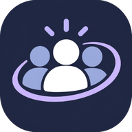

# Kollokvie@IFI

**Finn og hold kontakt med kollokviegruppen din på Institutt for informatikk, UiO.**

[**kollokvie-ifi.no**](https://kollokvie-ifi.no)

 

## Hva er det?

Kollokvie@IFI er en gratis webapp der studenter ved IFI kan **lage og finne kollokviegrupper**, følge hverandre og holde oversikt over eksamener og innleveringer i en felles kalender. Den fungerer som en vanlig nettside på PC og som en app på mobilen (legg den til på hjemskjermen).

*In English: a free web app for students at the Department of Informatics, University of Oslo, to find and create study groups, follow each other and keep track of exams and deadlines. It is an independent student project.*

## Tanken bak

Å finne noen å lese sammen med skjer i dag i tilfeldige Facebook-grupper, Discord-servere og meldingstråder som glemmes bort. Kollokvie@IFI samler det på ett sted:

- **Finn en gruppe som passer**: filtrer på emne, dato og om gruppen er åpen, privat eller kun for inviterte.
- **Se hvem du leser med**: følg medstudenter, se felles kontakter, og velg selv hvor mye av profilen din andre får se.
- **Ha kontroll på fristene**: eksamener og obliger ligger i kalenderen sammen med gruppemøtene dine, med nedtelling og mulighet til å krysse av.

Det er laget av en student, for studenter, og er ikke en offisiell tjeneste fra UiO.

## Funksjoner

**Kollokviegrupper**
- Lag, finn, bli med og inviter. Emne, sted, dato, tid og maks antall deltakere.
- Tre nivåer: åpen, privat (bare for de du følger eller som følger deg) og kun invitasjon.

**Kalender**
- Måned og semester (med UiOs semesterdatoer), eksamen, oblig, annet og **notater for dagen**, med emnefarger og filter.
- Legg til og endre hendelser med appens egen dato- og tidsvelger. Kollokviegruppene dine dukker opp på riktig dag.
- På PC: to kolonner med frister og valgt dag ved siden av måneden.

**Profil og personvern**
- Åpen eller privat profil. Privat: andre ser bare navn og ikon. Åpen: også studielinje, årstrinn, emner, bio og lenker. De som følger deg ser alltid alt.
- 65 ferdige profilikoner eller eget bilde. Følgeforespørsler må godkjennes.
- Last ned alle dataene dine eller slett kontoen når som helst.

**Søk og Utforsk**
- Søk etter folk og kollokviegrupper. Uten søketekst vises de du har felles kontakter med først, resten alfabetisk.

**Ellers**
- Lyst og mørkt tema, norsk og engelsk, og tilgjengelighet i tankene (tastatur, skjermlesere, redusert bevegelse).

## Personvern og sikkerhet

Personvern og sikkerhet er bygget inn, ikke lagt på:

- Innlogging med UiO-e-postadressen (bekreftet med engangskode), og passord som lagres som saltet hash hos Supabase Auth.
- Tilgang til data håndheves i selve databasen (Row Level Security), ikke bare i appen. Private profiler er skjult på databasenivå.
- Sikkerhetshoder, Content-Security-Policy med nonce, rens av all tekst før lagring, kvoter og hastighetsgrenser mot misbruk.
- Ingen sporing, reklame eller analyse. Bare nødvendige informasjonskapsler.
- Personvernerklæring, bruksvilkår, informasjonskapsler og tilgjengelighetserklæring på norsk og engelsk.

Fant du en sårbarhet? Se [SECURITY.md](SECURITY.md).

## Bygget med

[Next.js](https://nextjs.org) · [React](https://react.dev) · [TypeScript](https://www.typescriptlang.org) · [Tailwind CSS](https://tailwindcss.com) · [Supabase](https://supabase.com) (database, innlogging og lagring) · [Vercel](https://vercel.com) (hosting) · [Resend](https://resend.com) (e-post)

Detaljer om oppsett, database og drift står i [docs/oppsett-og-drift.md](docs/oppsett-og-drift.md).

## Om prosjektet

Kollokvie@IFI er et uavhengig studentprosjekt av [Henning Trillhus](https://github.com/HenningTrillhus). Det er **ikke** laget, godkjent eller drevet av Universitetet i Oslo eller Institutt for informatikk. Kontaktinformasjon finner du på [kollokvie-ifi.no/personvern](https://kollokvie-ifi.no/personvern).
